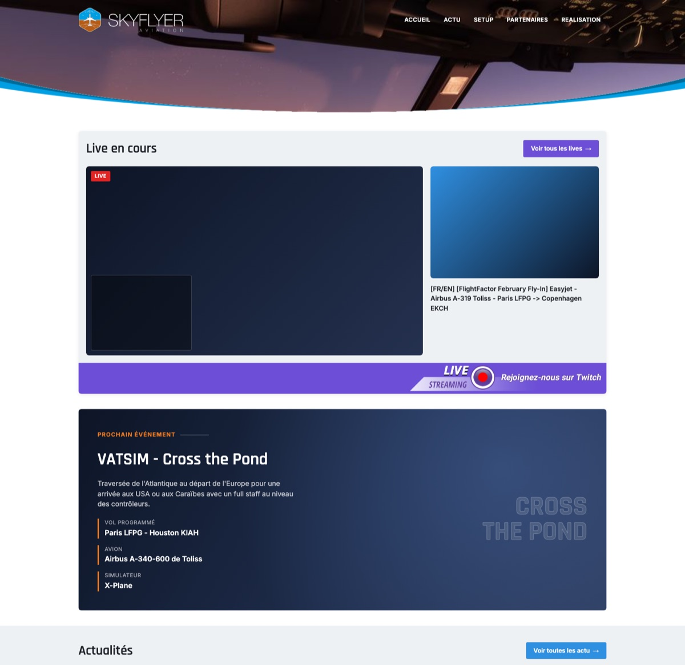

# Skyflyer Aviation

Site vitrine de la chaine Twitch/Youtube Skyflyer Aviation 

## Preview



## Stack

- [Vue 3](https://vuejs.org/) (`<script setup>`, JavaScript uniquement, pas de TypeScript)
- [Vite](https://vitejs.dev/)
- SCSS
- [Bun](https://bun.sh/) comme gestionnaire de paquets

## Démarrage

```bash
bun install
bun run dev
```

L'application est servie sur [http://localhost:5173](http://localhost:5173).

## Scripts

| Commande         | Description                              |
| ---------------- | ----------------------------------------- |
| `bun run dev`     | Lance le serveur de développement Vite   |
| `bun run build`   | Build de production dans `dist/`         |
| `bun run preview` | Sert le build de production localement   |

## Structure

```
src/
  App.vue              # composant racine, assemble les sections de la page
  main.js              # point d'entrée, monte l'app Vue
  components/          # une SFC .vue par section (Header, Gallery, NewsList, ...)
  data/                 # données statiques (navigation, actus, partenaires, réseaux sociaux)
  styles/               # SCSS, un partiel par composant
  assets/               # images importées par les composants (logo, visuels)
  screenshots/          # captures d'écran affichées dans la galerie
public/                 # favicons et fichiers statiques servis tels quels
```
