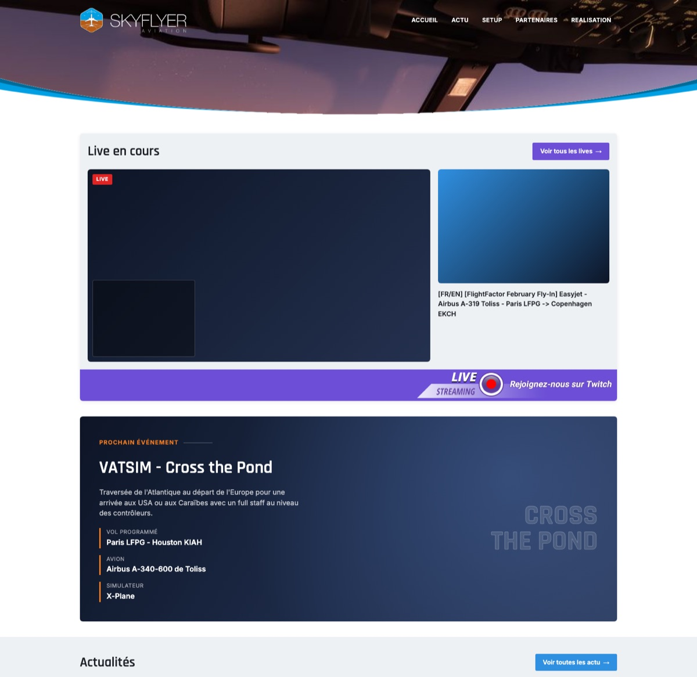

# Skyflyer Aviation

Site vitrine de la chaine Twitch/Youtube Skyflyer Aviation 

## Preview



## Stack

- [Vue 3](https://vuejs.org/) (`<script setup>`, JavaScript uniquement, pas de TypeScript)
- [Vite](https://vitejs.dev/)
- SCSS
- [Bun](https://bun.sh/) comme gestionnaire de paquets

## Démarrage

```bash
bun install
bun run dev
```

L'application est servie sur [http://localhost:5173](http://localhost:5173).

## Scripts

| Commande         | Description                              |
| ---------------- | ----------------------------------------- |
| `bun run dev`     | Lance le serveur de développement Vite   |
| `bun run build`   | Build de production dans `dist/`         |
| `bun run preview` | Sert le build de production localement   |

## Intégration Twitch

La section "Live en cours" (`src/components/LiveStream.vue`) affiche le vrai lecteur Twitch, plus le jeu joué et le titre du live via l'API Twitch (Helix). Ça nécessite deux identifiants dans un fichier `.env` (jamais commité — copier `.env.example`) :

```bash
cp .env.example .env
```

1. Créer une application sur [dev.twitch.tv/console/apps](https://dev.twitch.tv/console/apps) (catégorie "Website Integration", n'importe quelle OAuth Redirect URL, ex. `http://localhost:5173`).
2. Récupérer le **Client ID** et le **Client Secret** de cette application.
3. Générer un **App Access Token** (une seule fois, en local, jamais depuis le navigateur) :
   ```bash
   curl -X POST 'https://id.twitch.tv/oauth2/token' \
     -d 'client_id=TON_CLIENT_ID' \
     -d 'client_secret=TON_CLIENT_SECRET' \
     -d 'grant_type=client_credentials'
   ```
   Renseigner le `client_id` et l'`access_token` de la réponse dans `.env` (`VITE_TWITCH_CLIENT_ID` / `VITE_TWITCH_ACCESS_TOKEN`).

⚠️ **Le Client Secret ne doit jamais aller dans `.env` ni dans le code** : seul l'access token généré ci-dessus y va. Ce token expire au bout d'environ 60 jours et devra être régénéré manuellement (pas de backend ici pour l'automatiser) — il sera aussi visible dans le bundle JS une fois le site déployé, car c'est un site 100% statique. C'est un compromis assumé : le token ne permet que de lire des données publiques (streams/jeux en cours), rien de sensible.

Sans `.env` renseigné, le lecteur Twitch fonctionne quand même (il n'a besoin d'aucune clé), seuls le jeu et le titre du live affichent un message d'indisponibilité.

## Formulaire de contact

Le formulaire de la section Contact (`src/components/Contact.vue`) envoie les messages à `adelkamel1982@gmail.com` via [Web3Forms](https://web3forms.com/), un service gratuit qui évite d'avoir à héberger un backend juste pour recevoir des e-mails.

1. Aller sur [web3forms.com](https://web3forms.com/), renseigner `adelkamel1982@gmail.com`, récupérer la clé d'accès reçue par e-mail.
2. L'ajouter dans `.env` : `VITE_WEB3FORMS_ACCESS_KEY=ta_clé`.

Cette clé est publique par nature (Web3Forms est conçu pour qu'elle soit visible côté client, comme le Client ID Twitch) — elle permet uniquement d'envoyer des messages vers l'adresse configurée, rien d'autre. Sans `.env` renseigné, le formulaire affiche un message d'erreur clair au lieu d'échouer silencieusement.

### Anti-spam (reCAPTCHA)

Le formulaire inclut un piège à bots (champ caché) et, si configuré, un contrôle [Google reCAPTCHA v2](https://www.google.com/recaptcha/about/) — utile car la clé Web3Forms ci-dessus, visible dans le code du site, pourrait en théorie être utilisée directement par quelqu'un pour spammer l'adresse configurée en contournant le site. La configuration se fait en deux endroits distincts, à ne pas confondre :

1. Sur [google.com/recaptcha/admin](https://www.google.com/recaptcha/admin), créer un site de type **reCAPTCHA v2 ("Je ne suis pas un robot")** avec le domaine du site. Deux clés sont générées :
   - la **clé de site** (publique) → à mettre dans `.env` : `VITE_RECAPTCHA_SITE_KEY=ta_clé`.
   - la **clé secrète** → **ne jamais** la mettre dans `.env` ni dans le code (même règle que le Client Secret Twitch).
2. La clé secrète se configure côté Web3Forms, dans les paramètres du formulaire sur leur tableau de bord, pour qu'ils vérifient chaque soumission auprès de Google avant de transmettre l'e-mail.

Sans `VITE_RECAPTCHA_SITE_KEY`, le formulaire reste fonctionnel (piège à bots seul) — le widget ne s'affiche simplement pas.

## Structure

```
src/
  App.vue              # composant racine, assemble les sections de la page
  main.js              # point d'entrée, monte l'app Vue
  components/          # une SFC .vue par section (Header, Gallery, NewsList, ...)
  data/                 # données statiques (navigation, actus, partenaires, réseaux sociaux)
  styles/               # SCSS, un partiel par composant
  assets/               # images importées par les composants (logo, visuels)
  screenshots/          # captures d'écran affichées dans la galerie
public/                 # favicons et fichiers statiques servis tels quels
```
