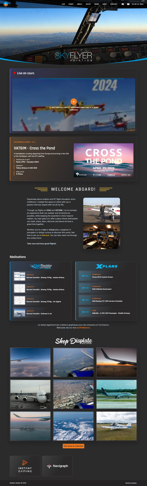

# Skyflyer Aviation

Site vitrine de la chaine Twitch/Youtube Skyflyer Aviation 

## Preview



Capture générée automatiquement par [.github/workflows/screenshot.yml](.github/workflows/screenshot.yml) : à chaque push sur `main`, le workflow build le site, le sert localement, prend un screenshot avec Playwright et repousse l'image mise à jour dans le dépôt. Rien à faire manuellement — l'aperçu ci-dessus reflète toujours la dernière version poussée.

## Stack

- [Vue 3](https://vuejs.org/) (`<script setup>`, JavaScript uniquement, pas de TypeScript)
- [Vite](https://vitejs.dev/)
- SCSS
- [Bun](https://bun.sh/) comme gestionnaire de paquets

## Démarrage

```bash
bun install
bun run dev
```

L'application est servie sur [http://localhost:5173](http://localhost:5173).

## Scripts

| Commande         | Description                              |
| ---------------- | ----------------------------------------- |
| `bun run dev`     | Lance le serveur de développement Vite   |
| `bun run build`   | Build de production dans `dist/`         |
| `bun run preview` | Sert le build de production localement   |
| `bun run screenshot` | Capture `docs/preview.png` (nécessite `bun run preview` déjà lancé sur le port 4173) |

## Intégration Twitch

La section "Live en cours" (`src/components/LiveStream.vue`) affiche le vrai lecteur Twitch, plus le jeu joué et le titre du live via l'API Twitch (Helix). Ça nécessite deux identifiants dans un fichier `.env` (jamais commité — copier `.env.example`) :

```bash
cp .env.example .env
```

1. Créer une application sur [dev.twitch.tv/console/apps](https://dev.twitch.tv/console/apps) (catégorie "Website Integration", n'importe quelle OAuth Redirect URL, ex. `http://localhost:5173`).
2. Récupérer le **Client ID** et le **Client Secret** de cette application.
3. Générer un **App Access Token** (une seule fois, en local, jamais depuis le navigateur) :
   ```bash
   curl -X POST 'https://id.twitch.tv/oauth2/token' \
     -d 'client_id=TON_CLIENT_ID' \
     -d 'client_secret=TON_CLIENT_SECRET' \
     -d 'grant_type=client_credentials'
   ```
   Renseigner le `client_id` et l'`access_token` de la réponse dans `.env` (`VITE_TWITCH_CLIENT_ID` / `VITE_TWITCH_ACCESS_TOKEN`).

⚠️ **Le Client Secret ne doit jamais aller dans `.env` ni dans le code** : seul l'access token généré ci-dessus y va. Ce token expire au bout d'environ 60 jours et devra être régénéré manuellement (pas de backend ici pour l'automatiser) — il sera aussi visible dans le bundle JS une fois le site déployé, car c'est un site 100% statique. C'est un compromis assumé : le token ne permet que de lire des données publiques (streams/jeux en cours), rien de sensible.

Sans `.env` renseigné, le lecteur Twitch fonctionne quand même (il n'a besoin d'aucune clé), seuls le jeu et le titre du live affichent un message d'indisponibilité.

## Formulaire de contact

Le formulaire de la section Contact (`src/components/Contact.vue`) envoie les messages à `adelkamel1982@gmail.com` via [Web3Forms](https://web3forms.com/), un service gratuit qui évite d'avoir à héberger un backend juste pour recevoir des e-mails.

1. Aller sur [web3forms.com](https://web3forms.com/), renseigner `adelkamel1982@gmail.com`, récupérer la clé d'accès reçue par e-mail.
2. L'ajouter dans `.env` : `VITE_WEB3FORMS_ACCESS_KEY=ta_clé`.

Cette clé est publique par nature (Web3Forms est conçu pour qu'elle soit visible côté client, comme le Client ID Twitch) — elle permet uniquement d'envoyer des messages vers l'adresse configurée, rien d'autre. Sans `.env` renseigné, le formulaire affiche un message d'erreur clair au lieu d'échouer silencieusement.

### Anti-spam (reCAPTCHA)

Le formulaire inclut un piège à bots (champ caché) et, si configuré, un contrôle [Google reCAPTCHA v2](https://www.google.com/recaptcha/about/) — utile car la clé Web3Forms ci-dessus, visible dans le code du site, pourrait en théorie être utilisée directement par quelqu'un pour spammer l'adresse configurée en contournant le site. La configuration se fait en deux endroits distincts, à ne pas confondre :

1. Sur [google.com/recaptcha/admin](https://www.google.com/recaptcha/admin), créer un site de type **reCAPTCHA v2 ("Je ne suis pas un robot")** avec le domaine du site. Deux clés sont générées :
   - la **clé de site** (publique) → à mettre dans `.env` : `VITE_RECAPTCHA_SITE_KEY=ta_clé`.
   - la **clé secrète** → **ne jamais** la mettre dans `.env` ni dans le code (même règle que le Client Secret Twitch).
2. La clé secrète se configure côté Web3Forms, dans les paramètres du formulaire sur leur tableau de bord, pour qu'ils vérifient chaque soumission auprès de Google avant de transmettre l'e-mail.

Sans `VITE_RECAPTCHA_SITE_KEY`, le formulaire reste fonctionnel (piège à bots seul) — le widget ne s'affiche simplement pas.

## Espace admin (Supabase)

Le contenu de "Prochain événement", "Partenaires" et "Mentions légales" n'est plus codé en dur : il vient de [Supabase](https://supabase.com/) modifiable depuis une mini-application séparée accessible sur `/admin.html`, protégée par un compte email/mot de passe.

### 1. Créer le projet Supabase

1. Créer un compte et un nouveau projet sur [supabase.com](https://supabase.com/).
2. Dans Project Settings → API, récupérer l'**URL du projet** et la clé **anon public**.
3. Les ajouter dans `.env` : `VITE_SUPABASE_URL=` et `VITE_SUPABASE_ANON_KEY=`.

### 2. Créer les tables et les droits d'accès (Row Level Security)

Dans Supabase → SQL Editor, exécuter :

```sql
create table event (
  id int primary key default 1,
  title text not null,
  description_fr text not null,
  description_en text not null,
  scheduled_flight text not null,
  aircraft text not null,
  simulator text not null,
  image_path text,
  image_width int,
  image_height int,
  updated_at timestamptz default now(),
  constraint single_row check (id = 1)
);

create table partners (
  id uuid primary key default gen_random_uuid(),
  name text not null,
  href text not null,
  logo_path text,
  logo_width int,
  logo_height int,
  display_order int not null default 0
);

create table legal_notice (
  id int primary key default 1,
  content_html text not null,
  updated_at timestamptz default now(),
  constraint single_row check (id = 1)
);

alter table event enable row level security;
alter table partners enable row level security;
alter table legal_notice enable row level security;

create policy "Lecture publique" on event for select using (true);
create policy "Lecture publique" on partners for select using (true);
create policy "Lecture publique" on legal_notice for select using (true);

create policy "Écriture admin uniquement" on event for all using (auth.role() = 'authenticated');
create policy "Écriture admin uniquement" on partners for all using (auth.role() = 'authenticated');
create policy "Écriture admin uniquement" on legal_notice for all using (auth.role() = 'authenticated');
```

Puis dans Storage, créer un bucket **public** nommé `site-uploads`, avec les mêmes policies (lecture publique, écriture réservée aux utilisateurs authentifiés).

⚠️ Sans ces policies RLS, la clé publique (`VITE_SUPABASE_ANON_KEY`, forcément visible dans le code du site une fois déployé) donnerait un accès total en lecture/écriture à n'importe qui. RLS est ce qui rend cette clé sans danger — ne jamais désactiver RLS sur ces tables.

### 3. Créer le compte admin

Dans Supabase → Authentication → Users, créer manuellement un utilisateur (email + mot de passe) : c'est ce compte qui se connecte sur `/admin.html`. Puis, dans Authentication → Providers → Email, désactiver **"Allow new user signups"** — il ne doit jamais être possible de créer un compte depuis le site, seulement depuis le tableau de bord Supabase.

### 4. Importer le contenu actuel

Script à exécuter une seule fois, en local (jamais en CI), avec la clé **service_role** (Project Settings → API) — différente de la clé anon, elle contourne RLS, donc ne doit **jamais** aller dans `.env` ni dans le code, seulement passée en variable d'environnement le temps de la commande :

```bash
SUPABASE_URL=ton_url SUPABASE_SERVICE_ROLE_KEY=ta_cle_service_role node scripts/seed-supabase.js
```

Après ce script, le site affiche exactement le même contenu qu'avant — rien ne change tant que personne n'édite quoi que ce soit depuis `/admin.html`.

### 5. Utiliser l'admin

```bash
bun run build
bun run preview
```

Ouvrir `http://localhost:4173/admin.html`, se connecter avec le compte créé à l'étape 3. Trois sections : Événement, Partenaires (ajout/édition/suppression), Mentions légales. Les images sont automatiquement redimensionnées et compressées en WebP par le navigateur avant l'envoi — pas besoin de les préparer à la main.

Sans `.env` configuré, le site public et l'admin affichent un message d'erreur clair au lieu d'échouer silencieusement (même principe que Twitch/Web3Forms).

## Structure

```
.github/workflows/      # automatisations CI (ex. screenshot.yml)
docs/                   # fichiers générés/documentaires (ex. preview.png)
public/                 # fichiers statiques servis tels quels (favicons...)
scripts/                # scripts Node exécutés hors navigateur (build-time ou ponctuels)
admin.html              # point d'entrée de la mini-app d'administration (voir plus haut)
src/
  App.vue               # composant racine, assemble les sections de la page dans <main>
  main.js               # point d'entrée du site public, monte l'app Vue sur #app
  admin/                 # mini-app d'administration séparée, jamais livrée au site public
                         #   (voir vite.config.js : deux points d'entrée = deux bundles distincts)
  components/           # une SFC .vue par section de page (Header, Gallery, Shop, Contact...)
  composables/          # état réactif partagé entre plusieurs composants (voir plus bas)
  lib/                   # clients de services externes partagés (ex. supabase.js)
  data/                 # données statiques ou pré-générées, importées par les composants
  styles/                # SCSS, organisé en base/ (reset, variables, polices, typo),
                         #   components/ (un partiel par composant) et layout/
  assets/                # images/animations importées directement par un composant précis
  logo/                  # logos des partenaires/plateformes (Displate, MSFS, X-Plane...)
  fonts/                 # polices auto-hébergées (.woff2), déclarées dans styles/base/_fonts.scss
  screenshots/           # captures de vol affichées dans la galerie et en fond de header
```

**`src/composables/`** — chacun expose un état réactif *partagé* (le même pour tout le monde qui l'importe, pas une nouvelle instance à chaque appel), pour éviter de faire remonter un état entre composants sans lien parent/enfant direct (props/emit) :
- `useContactModal.js` / `useLegalModal.js` — ouverture/fermeture des popups de contact et de mentions légales.
- `useLocale.js` — langue détectée (`fr`/`en`) via `navigator.language`, lue par tous les composants traduits.
- `useTwitchStream.js` — récupère le live en cours via l'API Twitch pour `LiveStream.vue` et la pastille rouge du menu.
- `useEventData.js`, `usePartnersData.js`, `useLegalNoticeData.js` — lecture (site public) et écriture (admin) des données Supabase.

**`src/data/`** — deux types de fichiers à ne pas confondre :
- Données écrites à la main (`navigation.js`, `news.js`, `social.js`, `shop.js`, `xplane-contributions.js`) : à modifier directement pour changer le contenu du site.
- `flightsim-contributions.json` : généré automatiquement par `scripts/fetch-contributions.js` (voir le script `prebuild`) — ne pas éditer à la main, il sera écrasé au prochain build.

Les partenaires, l'événement à venir et les mentions légales ne sont plus dans `src/data/` : ils viennent de Supabase (voir "Espace admin" plus haut).
